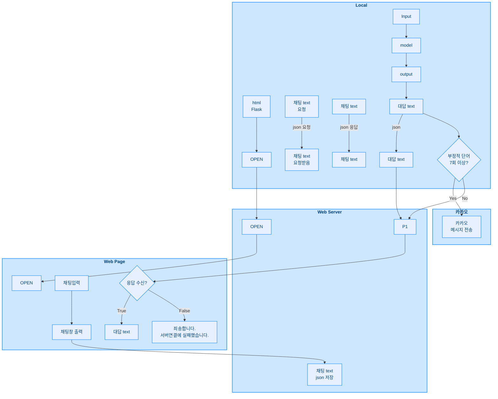

```mermaid
flowchart TB
  %% 스타일 정의
  classDef lane fill:#cce7ff,stroke:#3399ff,stroke-width:2px,color:#004080,font-weight:bold;
  classDef node fill:#e6f0ff,stroke:#3399ff,stroke-width:1.5px,color:#004080;

  %% Local (첫 번째)
  subgraph L[Local]
    direction TB
    L1["html\nFlask"]:::node --> L2[OPEN]:::node
    L3["채팅 text\n요청"]:::node -->|json 요청| W1
    W2["채팅 text"]:::node
    W2 -->|json 응답| L4["채팅 text"]:::node
    L5[Input]:::node --> L6[model]:::node --> L7[output]:::node --> L8["대답 text"]:::node
    L8 -->|json| W3
    D1{"부정적 단어\n7회 이상?"}:::node
    L8 --> D1
  end
  class L lane;

  %% Web Server (두 번째)
  subgraph W[Web Server]
    direction TB
    W0[OPEN]:::node
    W4["채팅 text\njson 저장"]:::node
    W1["채팅 text\n요청받음"]:::node
    W3["대답 text"]:::node --> P1
  end
  class W lane;

  %% Web Page (세 번째)
  subgraph P[Web Page]
    direction TB
    P0[OPEN]:::node
    P2[채팅입력]:::node --> P3[채팅창 출력]:::node --> W4
    P1 --> C{"응답 수신?"}:::node
    C -->|True| P4["대답 text"]:::node
    C -->|False| P5["죄송합니다.\n서버연결에 실패했습니다."]:::node
  end
  class P lane;

  %% Kakao (마지막)
  subgraph K[카카오]
    direction TB
    K1["카카오\n메시지 전송"]:::node
  end
  class K lane;

  %% 흐름 연결 순서대로 세로로
  L2 --> W0
  W0 --> P0
  D1 -->|Yes| K1
  D1 -->|No| P1

```
