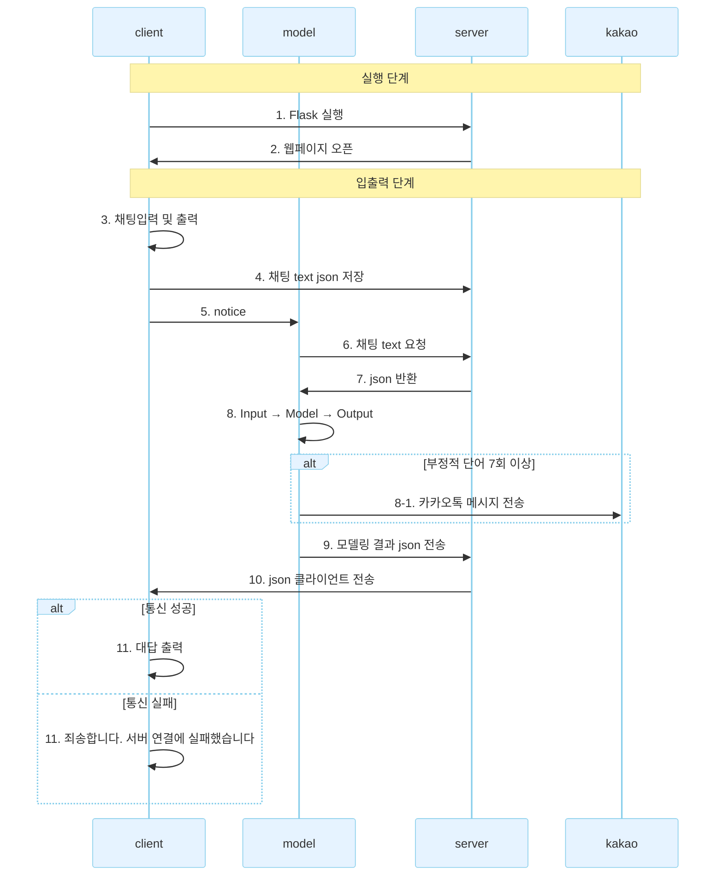

```mermaid
sequenceDiagram
    %%{init: {'theme':'base', 'themeVariables': { 'primaryColor': '#e6f3ff', 'primaryTextColor': '#333', 'primaryBorderColor': '#87ceeb', 'lineColor': '#333'}}}%%
    participant C as client
    participant M as model
    participant S as server
    participant K as kakao
    
    Note over C,K: 실행 단계
    C->>S: 1. Flask 실행
    S->>C: 2. 웹페이지 오픈
    
    Note over C,K: 입출력 단계
    C->>C: 3. 채팅입력 및 출력
    C->>S: 4. 채팅 text json 저장
    
    C->>M: 5. notice
    M->>S: 6. 채팅 text 요청
    S->>M: 7. json 반환
    M->>M: 8. Input → Model → Output
    
    alt 부정적 단어 7회 이상
        M->>K: 8-1. 카카오톡 메시지 전송
    end
    
    M->>S: 9. 모델링 결과 json 전송
    S->>C: 10. json 클라이언트 전송
    
    alt 통신 성공
        C->>C: 11. 대답 출력
    else 통신 실패
        C->>C: 11. 죄송합니다. 서버 연결에 실패했습니다
    end
```
