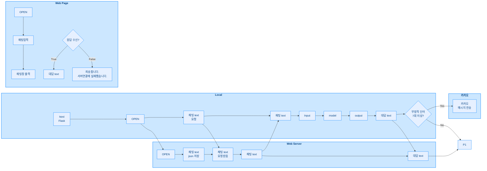

```mermaid
flowchart LR
  %% 스타일 지정 (파란 하늘색 계열)
  classDef lane fill:#cce7ff,stroke:#3399ff,stroke-width:2px,color:#004080,font-weight:bold;
  classDef node fill:#e6f0ff,stroke:#3399ff,stroke-width:1.5px,color:#004080;

  %% Local lane
  subgraph Local["Local"]
    direction TB
    L1["html\nFlask"]:::node
    L2[OPEN]:::node
    L3["채팅 text\n요청"]:::node
    L4["채팅 text"]:::node
    L5[Input]:::node
    L6[model]:::node
    L7[output]:::node
    L8["대답 text"]:::node
    D1{"부정적 단어\n7회 이상?"}:::node
    L1 --> L2 --> L3 --> L4 --> L5 --> L6 --> L7 --> L8 --> D1
  end
  class Local lane;

  %% Web Server lane
  subgraph WebServer["Web Server"]
    direction TB
    W0[OPEN]:::node
    W4["채팅 text\njson 저장"]:::node
    W1["채팅 text\n요청받음"]:::node
    W2["채팅 text"]:::node
    W3["대답 text"]:::node
    W0 --> W4 --> W1 --> W2 --> W3
  end
  class WebServer lane;

  %% Web Page lane
  subgraph WebPage["Web Page"]
    direction TB
    P0[OPEN]:::node
    P2[채팅입력]:::node
    P3[채팅창 출력]:::node
    P4["대답 text"]:::node
    P5["죄송합니다.\n서버연결에 실패했습니다."]:::node
    C{"응답 수신?"}:::node
    P0 --> P2 --> P3
    C -->|True| P4
    C -->|False| P5
  end
  class WebPage lane;

  %% 컬럼 간 흐름 연결 (좌->우)
  L2 --> W0
  L3 --> W1
  W3 --> P1
  L8 --> W3
  W2 --> L4

  D1 -->|Yes| K1["카카오\n메시지 전송"]:::node
  D1 -->|No| P1

  %% Kakao 별도
  subgraph Kakao["카카오"]
    direction TB
    K1
  end
  class Kakao lane;

```
